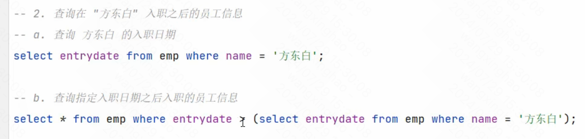
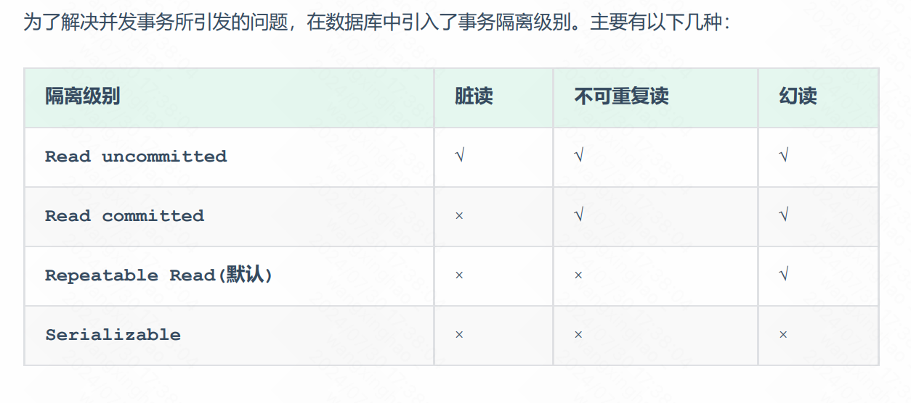

# mysql-基础篇

## 1.DDL 相关


## 2.DML 相关


## 3.DQL 相关

### 3.1.基本语法


### 3.2.基础查询

有两点需要注意，字段可以设置别名：

```sql
select ${字段1} AS ${别名1} from ${表名};
```

另外可以去除重复记录：

```sql
SELECT DISTINCT 字段列表 FROM 表名;
```

### 3.3.条件查询


NOT 表示非，例如， 查询有身份证号的员工信息：

```sql
select * from emp where idcard is not null;
```

% 和 _ 都是 like 中的占位符，前者表示任意个字符，后者表示一个字符。

### 3.4.聚合查询

聚合函数是将一列数据作为整体，进行纵向计算的。常见的聚合函数为：


注意 : NULL 值是不参与所有聚合函数运算的。

聚合函数的使用语法为 `SELECT 聚合函数(字段列表) FROM 表名;`。

> 引申，count(*)、count(主键id)、count(字段)、count(1)实现原理和性能比较，参考文章：https://blog.csdn.net/jack1liu/article/details/106888747。

### 3.5.分组查询


执行顺序很重要，where > 聚合函数 > having，此外 join > where。如何理解分组查询？参考：https://www.cnblogs.com/jiaozhang/p/14473313.html。

多字段分组时，按照整体来看，关键是引入一个中间表。

### 3.6.排序查询


如果是多字段排序，当第一个字段值相同时，才会根据第二个字段进行排序。

### 3.7.分页查询


### 3.8.执行顺序


这个执行顺序很重要，会影响到语法，例如：

我们可以给select后面的字段起别名，然后在 where 中使用这个别名，然后看看是否可以执行成功。

```sql
select e.name ename , e.age eage from emp e where eage > 15 order by age asc;
```

执行上述 SQL 报错了，由此可以得出，from 先执行，然后执行 where，再执行select。

## 4.约束

概念：约束是作用于表中字段上的规则，用于限制存储在表中的数据。

目的：保证数据库中数据的正确、有效性和完整性。

分类：


下面是一个建表时创建约束的例子。

```sql
CREATE TABLE tb_user(
  id int AUTO_INCREMENT PRIMARY KEY COMMENT 'ID唯一标识',
  name varchar(10) NOT NULL UNIQUE COMMENT '姓名' ,
  age int check (age > 0 && age <= 120) COMMENT '年龄' ,
  status char(1) default '1' COMMENT '状态',
  gender char(1) COMMENT '性别'
);
```

下面主要介绍外键约束。

### 4.1.外键约束

没有外键约束时的关联：


如果部门表中 id 为 1 的部门，被删掉，那么员工表中还会存在 id 为 1 的部门。

我们可以通过添加外键来解决这一点，如下所示：


上述外键的删除/更新行为只能选择一种。

## 5.多表查询

### 5.1.多表关系

各个表结构之间存在各种联系，分为以下三种：

* 一对多（多对一）。

  

* 多对多。

  

* 一对一。

  

### 5.2.多表查询概述

可以使用下面的语法直接进行多表查询：

```sql
select * from A, B;
```

此时会出现表 A 和表 B 之间的笛卡尔积运算，如下所示：


可以使用连接查询条件 where 去掉冗余的多表查询结果。

多表查询有如下分类：


### 5.3.内连接

内连接语法存在两种，一是隐式内连接，二是显式内连接，如下所示：


> 掌握一个概念，驱动表和被驱动表，先了解在join连接时哪个表是驱动表，哪个表是被驱动表：
>
> 1. 当使用 left join 时，左表是驱动表，右表是被驱动表
> 2. 当使用 right join 时，右表时驱动表，左表是被驱动表
> 3. 当使用 join 时，mysql会选择数据量比较小的表作为驱动表，大表作为被驱动表。
>
> MySQL 表关联的算法是 Nest Loop Join，是通过驱动表的结果集作为循环基础数据，然后一条一条地通过该结果集中的数据作为过滤条件到下一个表中查询数据，然后合并结果。如果还有第三个参与Join，则再通过前两个表的Join结果集作为循环基础数据，再一次通过循环查询条件到第三个表中查询数据，如此往复。
>
> 关于驱动表和被驱动表，参考：https://blog.xiaobaicai.fun/mysql/76616.html。

where 和 on 进行筛选时的区别：

在选用`ON`和`WHERE`时，除非执行效率不可接受，否则只应该使用`ON`声明表连接条件、使用`WHERE`声明数据筛选条件。

> 因为 ON 是先筛选再连接，而 WHERE 是先连接再筛选，因此 ON 做连接效率比较高。

### 5.4.外连接


左外连接和右外连接是可以相互替换的，只需要调整在连接查询时 SQL 中表结构的先后顺序就可以了；而我们在日常开发使用时，更偏向于左外连接。

### 5.5.自连接


在自连接查询中，必须要为表起别名，要不然我们不清楚所指定的条件、返回的字段，到底是哪一张表的字段。

### 5.6.联合查询


## 6.子查询


对于子查询的问题，可以不断拆解问题来解决，譬如先进行第一次查询，然后进行第二次查询。之后考虑将两次查询合并起来。

### 6.1.标量子查询

子查询返回的结果是单个值（数字、字符串、日期等），最简单的形式，这种子查询称为标量子查询。常用的操作符：= <> > >= < <= 。

子查询的结果只有一行一列，也就是一个标量数据，一个例子如下：



### 6.2.列子查询


列子查询的返回结果是**一列多行**。下面是一个例子：


其中，第一行 SQL 语句返回的结果是一列多行的 (2, 4)。

> 如果返回值是一列多行的话，那么需要使用上面的操作符来处理。

### 6.3.行子查询


一个典型的例子如下：


### 6.4.表子查询

子查询返回的结果是多行多列，常用的操作符为 IN。


子查询不仅可以放到 where 之后，还可以放到 from 之后：


### 6.5.总结


## 7.事务

默认 MySQL 的事务是自动提交的，也就是说，当执行完一条 DML 语句时，MySQL 会立即隐 式的提交事务。

### 7.1.并发事务问题


为了解决事务并发出现的问题，数据库中引入了隔离级别的概念，如下所示：



> 关于事务的更多原理内容，在进阶篇进行学习。


