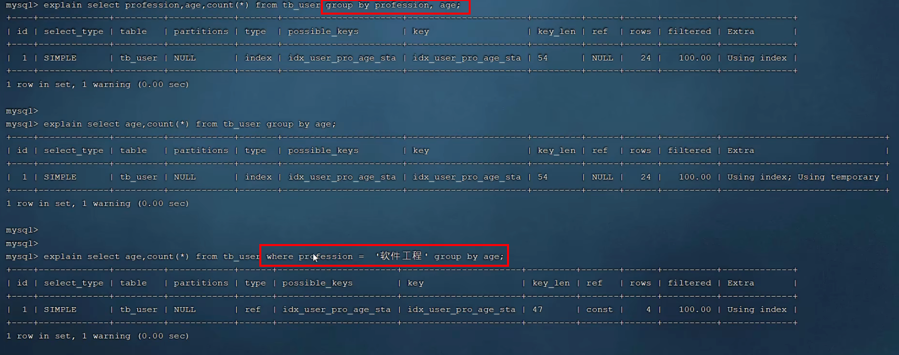

# mysql-进阶篇

## 1.innodb 存储引擎


## 2.索引

> 每个索引都会对应一个 B+ 树。

### 1.B 树与 B+ 树

> 分裂只会**向上分裂**，而不会向下分裂。


4 个 key，就有 5 个间隙，每个间隙放置一个指针。


mysql 是带有双向链表的 B+ 树。

为什么选择 B+ Tree，而不是 B Tree？


### 2.分类


聚簇索引和二级索引的结构：


二级索引的叶子节点包含主键（非叶子节点是页号）以及对应的索引值。

> 根据某个字段构建的二级索引，自然是根据它升序排列的。

回表查询：


如果二级索引不包含被查询字段，才需要回表查询。参考：https://juejin.cn/post/7052581269699297317。

### 3.语法

查询索引 `show index from tb;`

创建普通索引 `create (unique) index ... on table(col1, col2, col3);`

删除索引 `drop index ... on table(col);`

> 什么是联合索引。
>
> 
>
> 

### 4.性能分析——Select 语句

#### 1.执行频率

```sql
-- session 是查看当前会话 ;
-- global 是查询全局数据 ;
SHOW GLOBAL STATUS LIKE 'Com_______';
```

#### 2.慢查询日志


#### 3.profile 详情（感觉比较捞）


#### 4.explain


**key_len 字段能够检查是否充分的利用上了索引**

### 5.索引的使用

#### 1.最左前缀法则

如果索引了多列（联合索引），要遵守最左前缀法则。最左前缀法则指的是查询从索引的最左列开始， 并且不跳过索引中的列。如果跳跃某一列，索引将会部分失效(后面的字段索引失效)。

> 最左前缀法则中指的最左边的列，是指在查询时，联合索引的最左边的字段(即是 第一个字段)必须存在，与我们编写SQL时，条件编写的先后顺序无关。


为什么范围查询时，索引会失效？

参考索引失效的原理，profession 可以利用二分继续优化查询，但是 age 无法利用二分优化查询了。

#### 2.索引失效情况

1. 对索引使用函数或者是表达式计算（因为索引保存的是索引字段的原始值，而不是经过函数计算后的值，自然就没办法走索引了）。
2. 字符串不加引号，也就是隐式转换（**MySQL 在遇到字符串和数字比较的时候，会自动把字符串转为数字，然后再进行比较**，而使用转换函数是会使索引失效的）。
3. 使用 %x 或者 %x% 模糊匹配时。
4. or 连接时，如果被分割的字段有一个没有索引，那么都不走索引。
5. 数据分布影响（如果 MySQL 认为使用索引会比全表扫描更慢，那么就不使用索引，因为使用索引可能会出现**回表**）。

> 

#### 3.覆盖索引

尽量使用覆盖索引，减少select *。 那么什么是覆盖索引呢？ 覆盖索引是指 查询使用了索引，并 且需要返回的列，在该索引中已经全部能够找到 。

> 覆盖索引能够防止回表查询。

#### 4.前缀索引

当字段类型为字符串（varchar，text，longtext等）时，有时候需要索引很长的字符串，这会让 索引变得很大，查询时，浪费大量的磁盘IO， 影响查询效率。此时可以只将字符串的一部分前缀，建 立索引，这样可以大大节约索引空间，从而提高索引效率。

语法：

```sql
create index idx_xxxx on table_name(column(n));
```


前缀索引的查询流程：


#### 5.单列索引与多列索引

单列索引：即一个索引只包含单个列。联合索引：即一个索引包含了多个列。


单列索引会走回表查询，因为索引只能选择一个。

> 如果执行 sql 语句时，可以使用的索引很多，mysql 会自动选择一个索引，但是如果我们想指定的话，可以使用 **sql 提示——use index()**。

### 6.索引设计原则


用到索引的子句包括：

1. where
2. order by
3. group by

索引越多，维护成本也越大，会影响增删改的效率。

## 3.SQL 优化

### 1.insert 优化

* 批量插入。
* 手动提交事务，防止高频 DML 时，事务被频繁开启和关闭。
* 主键顺序插入（主键顺序插入性能高于乱序插入）。

当需要大批量插入数据时，不使用 insert，而是要使用 load。


### 2.主键优化

Innodb 中的数据组织方式：


逻辑结构图：


在InnoDB引擎中，数据行是记录在逻辑结构 page 页中的，而每一个页的大小是固定的，默认16K。 那也就意味着， 一个页中所存储的行也是有限的，如果插入的数据行row在该页存储不小，将会存储 到下一个页中，页与页之间会通过指针连接。

两种现象：

1. 页分裂——主键乱序时会频繁造成**页分裂**。页可以为空，也可以填充一半，也可以填充100%。每个页包含了2-N行数据(如果一行数据过大，会行 溢出)，根据主键排列。
2. 页合并，删除 row 时会发生。当页中删除的记录达到 MERGE_THRESHOLD（默认为页的50%），InnoDB会开始寻找最靠近的页（前 或后）看看是否可以将两个页合并以优化空间使用。

主键设计原则：

1. 满足业务需求的情况下，尽量降低主键的长度。
2. 插入数据时，尽量选择顺序插入，选择使用AUTO_INCREMENT自增主键。
3. 尽量不要使用UUID做主键或者是其他自然主键，如身份证号。
4. 业务操作时，避免对主键的修改。

### 3.order by 优化

MySQL的排序，有两种方式：

1. Using filesort : 通过表的索引或全表扫描，读取满足条件的数据行，**然后在排序缓冲区sort buffer中完成排序操作**，所有不是通过索引直接返回排序结果的排序都叫 FileSort 排序。
2. Using index : 通过有序索引顺序扫描直接返回有序数据，这种情况即为 using index，不需要 额外排序，操作效率高。

对于以上的两种排序方式，Using index的性能高，而Using filesort的性能低，我们在优化排序操作时，尽量要优化为 Using index。


### 4.group by 优化

> 原因是因为对于分组操作， 在联合索引中，也是符合最左前缀法则的。

在分组操作中，我们需要通过以下两点进行优化，以提升性能：



1. 在分组（还有 select 和 order by）操作时，可以通过索引来提高效率。
2. 分组操作时，索引的使用也是满足最左前缀法则的。

> Extra 中的 Using temporary 和 Using filesort，前者表示用了临时表，后者表示用了排序。
>
> Using temporary表示由于排序没有走索引、使用`union`、`子查询连接查询`,`group_concat（）`或`count（distinct）`表达式的求值等等创建了一个内部临时表。

临时表也分为内存临时表和磁盘临时表。如果数据量实在过大，大到内存临时表都不够用了，这时就转向使用磁盘临时表。

内存临时表的大小是有限制的，mysql 中 tmp_table_size 代表的就是内存临时表的大小，默认是 16M。当然你可以自定义社会中适当大一点，这就要根据实际情况来定了。

### 5.limit 分页查询优化

在数据量比较大时，如果进行limit分页查询，在查询时，越往后，分页查询效率越低。

因为，当在进行分页查询时，如果执行 limit 2000000,10 ，此时需要MySQL排序前2000010 记 录，仅仅返回 2000000 - 2000010 的记录，其他记录丢弃，**查询排序的代价非常大** 。

优化思路：一般分页查询时，通过创建覆盖索引能够比较好地提高性能，可以通过**覆盖索引加子查询形式进行优化**。

> 为了防止数据分布影响造成索引失效，使用 `order by` 子句实现显示使用索引。


### 6.count 优化

MyISAM 引擎把一个表的总行数存在了磁盘上，因此执行 count(\*) 的时候会直接返回这个 数，效率很高； 但是如果是带条件的count，MyISAM也慢。

 InnoDB 引擎就麻烦了，它执行 count(\*) 的时候，需要把数据一行一行地从引擎里面读出 来，然后累积计数。

count() 是一个聚合函数，对于返回的结果集，一行行地判断，**如果 count 函数的参数不是 NULL**，累计值就加 1，否则不加，最后返回累计值。 

> count(null) 就是 0。

用法：count（*）、count（主键）、count（字段）、count（数字）


按照效率排序的话，count(字段) < count(主键 id) < count(1) ≈ count(\*)，所以尽 量使用 count(\*)。

### 7.update 优化


InnoDB的行锁是针对索引加的锁，不是针对记录加的锁 ,并且该索引不能失效，否则会从行锁 升级为表锁 。

## 4.锁

MySQL中的锁，按照锁的粒度分，分为以下三类：

1. 全局锁：锁定数据库中的所有表。
2. 表级锁：每次操作锁住整张表。
3. 行级锁：每次操作锁住对应的行数据。

其中，表锁分为：

1. 表锁。
2. 意向锁。
3. 元数据锁（为了避免DML与 DDL冲突，保证读写的正确性）。

### 1.行级锁


> 肯定是先结束事务，再释放锁。

默认情况下，InnoDB在 REPEATABLE READ事务隔离级别运行，InnoDB使用 next-key 锁进行搜索和索引扫描，以防止幻读。

1. 针对唯一索引进行检索时，对已存在的记录进行等值匹配时，将会自动优化为行锁。
2. InnoDB的行锁是针对于索引加的锁，不通过索引条件检索数据，那么InnoDB将对表中的所有记 录加锁，此时 就会升级为表锁。

而关于间隙锁和 next-key 锁：

1. 索引上的等值查询(唯一索引)，给不存在的记录加锁时，优化为间隙锁 。
2.  索引上的等值查询(非唯一普通索引)，向右遍历时最后一个值不满足查询需求时，next-key lock 退化为间隙锁。
3. 索引上的范围查询(唯一索引)--会访问到不满足条件的第一个值为止。


# 附录

## 1.MySQL 使用 like %x，索引一定会失效吗？

我们都知道联合索引要遵循最左匹配才能走索引，但是如果数据库表中的字段都是索引的话，即使查询过程中，没有遵循最左匹配原则，也是走全扫描二级索引树(type=index)。


## 2.全表扫描和索引扫描的区别


索引树扫描我们是比较熟悉的，它就是会遍历聚簇索引树，底层是一颗B+树，叶子节点存储了所有的实际行数据。其实，全表扫描也是扫描的聚簇索引树，因为聚簇索引树的叶子节点中存储的就是实际数据，只要扫描遍历聚簇索引树就可以得到全表的数据了。

> 对于索引扫描来讲，它只需要读取叶子节点的所有key，也就是索引的键，而不需要读取具体的 data 行数据；而对于全表扫描来说，它无法仅仅通过读取索引列获得需要的数据，还需要读取具体的data数据才能获取select中指定的非索引列的具体值。所以，全表扫描的效率相比于索引树扫描相对较低一点，但是差距不是很大。


## 3.mysql 的 insert 会加锁吗？

**会加行锁**，不会加表锁。

> 并且只会加写锁。


