# Redis原理篇

## 1、原理篇-Redis数据结构

### 1.1 Redis数据结构-动态字符串

我们都知道Redis中保存的Key是字符串，value往往是字符串或者字符串的集合。可见字符串是Redis中最常用的一种数据结构。

不过Redis没有直接使用C语言中的字符串，因为C语言字符串存在很多问题：

* 获取字符串长度的需要通过运算。
* 非二进制安全。
* 不可修改。

**Redis 构建了一种新的字符串结构，称为简单动态字符串（Simple Dynamic String），简称 SDS**。

例如，我们执行命令：


那么Redis将在底层创建两个SDS，其中一个是包含“name”的SDS，另一个是包含“虎哥”的SDS。

Redis是C语言实现的，其中SDS是一个结构体，源码如下：


结构体中的 `buf[]` 依旧会带有 `\0` 终止符。

例如，一个包含字符串“name”的sds结构如下：


**SDS之所以叫做动态字符串，是因为它具备动态扩容的能力**，例如一个内容为“hi”的SDS：


假如我们要给SDS追加一段字符串“,Amy”，这里首先会申请新内存空间：

如果新字符串小于1M，则新空间为扩展后字符串长度的两倍+1；

如果新字符串大于1M，则新空间为扩展后字符串长度+1M+1。称为**内存预分配**。

> 内存预分配需要从用户态切换到内核态，这会带来额外的开销。


这里的二进制安全指的是，数据本身不会因为 **\\0** 而终止。

### 1.2 Redis数据结构-intset

IntSet 是 Redis 中 set 集合的一种实现方式，**基于整数数组来实现，并且具备长度可变、有序等特征**。

结构如下：


其中的 encoding 包含三种模式，表示**存储的整数大小不同**：


为了方便查找，**Redis会将intset中所有的整数按照升序依次保存在contents数组中**，结构如图：


现在，数组中每个数字都在 int16_t 的范围内，因此采用的编码方式是INTSET_ENC_INT16，每部分占用的字节大小为：

* encoding：4字节
* length：4字节
* contents：2字节 * 3  = 6字节


我们向该其中添加一个数字：50000，这个数字超出了int16_t的范围，**intset会自动升级编码方式到合适的大小**。

以当前案例来说流程如下：

* 升级编码为INTSET_ENC_INT32, 每个整数占4字节，**并按照新的编码方式及元素个数扩容数组**。
* **倒序依次将数组中的元素拷贝到扩容后的正确位置**。
* 将待添加的元素放入数组末尾
* 最后，将inset的encoding属性改为INTSET_ENC_INT32，将length属性改为4


源码如下：


小总结：

**Intset可以看做是特殊的整数数组**，具备一些特点：

* Redis会确保Intset中的元素唯一、有序
* 具备类型升级机制，可以节省内存空间
* 底层采用二分查找方式来查询（以此来保证有序性）

### 1.3 Redis数据结构-Dict（先数组再链表）（Redis 渐进式 rehash）

我们知道Redis是一个键值型（Key-Value Pair）的数据库，我们可以根据键实现快速的增删改查。而键与值的映射关系正是通过Dict来实现的。

Dict由三部分组成，分别是：哈希表（DictHashTable）、哈希节点（DictEntry）、字典（Dict）


当我们向Dict添加键值对时，Redis首先根据key计算出hash值（h），**然后利用 h & sizemask来计算元素应该存储到数组中的哪个索引位置（等同于取余运算）**。我们存储k1=v1，假设k1的哈希值h =1，则1&3 =1，因此k1=v1要存储到数组角标1位置。


Dict由三部分组成，分别是：哈希表（DictHashTable）、哈希节点（DictEntry）、字典（Dict）


**Dict的扩容**

Dict中的HashTable就是数组结合单向链表的实现，当集合中元素较多时，必然导致哈希冲突增多，链表过长，则查询效率会大大降低。

Dict在每次新增键值对时都会检查负载因子（LoadFactor = used/size） ，满足以下两种情况时会触发哈希表扩容：

* 哈希表的 LoadFactor >= 1，并且服务器没有执行 BGSAVE 或者 BGREWRITEAOF 等后台进程；
* 哈希表的 LoadFactor > 5 ；


**Dict的rehash**

不管是扩容还是收缩，必定会创建新的哈希表，导致哈希表的size和sizemask变化，而key的查询与sizemask有关。**因此必须对哈希表中的每一个key重新计算索引，插入新的哈希表，这个过程称为rehash**。过程是这样的：

* 计算新hash表的realeSize，值取决于当前要做的是扩容还是收缩：
  * **如果是扩容，则新size为第一个大于等于dict.ht[0].used + 1的2^n**
  * **如果是收缩，则新size为第一个大于等于dict.ht[0].used的2^n （不得小于4）**

* 按照新的realeSize申请内存空间，创建dictht，并赋值给dict.ht[1]
* 设置dict.rehashidx = 0，标示开始rehash。
* 将dict.ht[0]中的每一个dictEntry都rehash到dict.ht[1]（依据最新的 sizemask 做哈希运算）。
* **将dict.ht[1]赋值给dict.ht[0]，给dict.ht[1]初始化为空哈希表，释放原来的dict.ht[0]的内存**。

  
* 将rehashidx赋值为-1，代表rehash结束。
* 在rehash过程中，新增操作，则直接写入ht[1]，查询、修改和删除则会在dict.ht[0]和dict.ht[1]依次查找并执行。**这样可以确保ht[0]的数据只减不增，随着rehash最终为空**

整个过程可以描述成：


小总结：

Dict的结构：

* 类似java的HashTable，底层是数组加链表来解决哈希冲突
* Dict包含两个哈希表，**ht[0]平常用，ht[1]用来rehash**。

Dict的伸缩：

* 当LoadFactor大于5或者LoadFactor大于1并且没有子进程任务时，Dict扩容
* 当LoadFactor小于0.1时，Dict收缩
* 扩容大小为第一个大于等于used + 1的2^n
* 收缩大小为第一个大于等于used 的2^n
* Dict采用渐进式rehash，**每次访问Dict时执行一次rehash（每次只迁移一个 KV（dictEntry））**
* rehash时ht[0]只减不增，新增操作只在ht[1]执行，其它操作在两个哈希表

### 1.4 Redis数据结构-ZipList

ZipList 是一种特殊的“双端链表” ，由一系列特殊编码的连续内存块组成。**可以在任意一端进行压入/弹出操作, 并且该操作的时间复杂度为 O(1)**。


| **属性** | **类型** | **长度** | **用途**                                                     |
| -------- | -------- | -------- | ------------------------------------------------------------ |
| zlbytes  | uint32_t | 4 字节   | 记录整个压缩列表占用的内存字节数                             |
| zltail   | uint32_t | 4 字节   | 记录压缩列表表尾节点距离压缩列表的起始地址有多少字节，通过这个偏移量，可以确定表尾节点的地址。 |
| zllen    | uint16_t | 2 字节   | 记录了压缩列表包含的节点数量。 最大值为UINT16_MAX （65534），如果超过这个值，此处会记录为65535，但节点的真实数量需要遍历整个压缩列表才能计算得出。 |
| entry    | 列表节点 | 不定     | 压缩列表包含的各个节点，节点的长度由节点保存的内容决定。     |
| zlend    | uint8_t  | 1 字节   | 特殊值 0xFF （十进制 255 ），用于标记压缩列表的末端。        |

**ZipListEntry**

ZipList 中的Entry并不像普通链表那样记录前后节点的指针，因为记录两个指针要占用16个字节，浪费内存。**而是采用了下面的结构**：


* previous_entry_length：前一节点的长度，占1个或5个字节。
  * 如果前一节点的长度小于254字节，则采用1个字节来保存这个长度值
  * 如果前一节点的长度大于254字节，则采用5个字节来保存这个长度值，第一个字节为0xfe，后四个字节才是真实长度数据

* encoding：编码属性，记录content的数据类型（字符串还是整数）以及长度，占用1个、2个或5个字节
* contents：负责保存节点的数据，可以是字符串或整数

ZipList中所有存储长度的数值均采用小端字节序，即低位字节在前，高位字节在后。例如：数值0x1234，采用小端字节序后实际存储值为：0x3412

**Encoding编码**

ZipListEntry中的encoding编码分为字符串和整数两种：

**字符串：如果encoding是以“00”、“01”或者“10”开头，则证明content是字符串**

| **编码**                                             | **编码长度** | **字符串大小**      |
| ---------------------------------------------------- | ------------ | ------------------- |
| \|00pppppp\|                                         | 1 bytes      | <= 63 bytes         |
| \|01pppppp\|qqqqqqqq\|                               | 2 bytes      | <= 16383 bytes      |
| \|10000000\|qqqqqqqq\|rrrrrrrr\|ssssssss\|tttttttt\| | 5 bytes      | <= 4294967295 bytes |

例如，我们要保存字符串：“ab”和 “bc”


 ZipListEntry中的encoding编码分为字符串和整数两种：

**整数：如果encoding是以“11”开始，则证明content是整数，且encoding固定只占用1个字节**

| **编码** | **编码长度** | **整数类型**                                               |
| -------- | ------------ | ---------------------------------------------------------- |
| 11000000 | 1            | int16_t（2 bytes）                                         |
| 11010000 | 1            | int32_t（4 bytes）                                         |
| 11100000 | 1            | int64_t（8 bytes）                                         |
| 11110000 | 1            | 24位有符整数(3 bytes)                                      |
| 11111110 | 1            | 8位有符整数(1 bytes)                                       |
| 1111xxxx | 1            | 直接在xxxx位置保存数值，范围从0001~1101，减1后结果为实际值 |


### 1.5 Redis数据结构-ZipList的连锁更新问题

ZipList的每个Entry都包含previous_entry_length来记录上一个节点的大小，长度是1个或5个字节：

* 如果前一节点的长度小于254字节，则采用1个字节来保存这个长度值。
* 如果前一节点的长度大于等于254字节，则采用5个字节来保存这个长度值，第一个字节为0xfe，后四个字节才是真实长度数据。

现在，假设我们有N个连续的、长度为250~253字节之间的entry，因此entry的previous_entry_length属性用1个字节即可表示，如图所示：


**ZipList这种特殊情况下产生的连续多次空间扩展操作称之为连锁更新（Cascade Update）。新增、删除都可能导致连锁更新的发生**。

> 涉及到内核态和用户态的切换，会产生额外的开销。

**小总结：**

**ZipList特性：**

* 压缩列表的可以看做**一种连续内存空间的"双向链表"**
* 列表的节点之间不是通过指针连接，**而是记录上一节点和本节点长度来寻址，内存占用较低**
* 如果列表数据过多，导致链表过长，**可能影响查询性能**
* 增或删较大数据时有可能发生**连续更新问题**

### 1.6 Redis数据结构-QuickList（先链表再数组）

问题1：ZipList虽然节省内存，但申请内存必须是连续空间，如果内存占用较多，**申请内存效率很低**。怎么办？

​	答：为了缓解这个问题，我们必须限制 ZipList 的长度和entry大小。

问题2：但是我们要存储大量数据，**超出了ZipList最佳的上限该怎么办**？

​	答：我们可以创建多个ZipList来分片存储数据。

问题3：数据拆分后比较分散，不方便管理和查找，这多个ZipList如何建立联系？

​	答：**Redis在3.2版本引入了新的数据结构QuickList，它是一个双端链表，只不过链表中的每个节点都是一个ZipList**。


为了避免QuickList中的每个ZipList中entry过多，Redis提供了一个配置项：list-max-ziplist-size来限制。

* 如果值为正，则代表ZipList的允许的entry个数的最大值
* 如果值为负，则代表ZipList的最大内存大小，分5种情况：
  * -1：每个ZipList的内存占用不能超过4kb
  * -2：每个ZipList的内存占用不能超过8kb
  * -3：每个ZipList的内存占用不能超过16kb
  * -4：每个ZipList的内存占用不能超过32kb
  * -5：每个ZipList的内存占用不能超过64kb

其默认值为 -2：


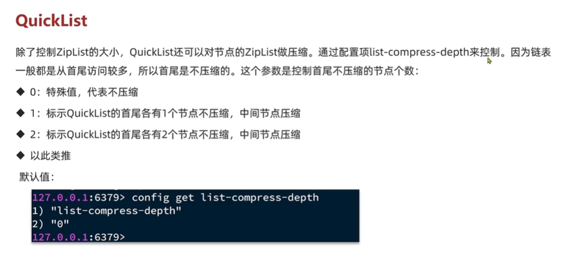

以下是QuickList的和QuickListNode的结构源码：


我们接下来用一段流程图来描述当前的这个结构


总结：

QuickList的特点（兼具了链表和数组优势的数据结构）：

* 是一个**节点为 ZipList 的双端链表**
* 节点采用 ZipList，解决了**传统链表的内存占用问题**（即头尾指针的额外内存空间）
* 控制了 ZipList 大小，**解决连续内存空间申请效率问题**（连续内存过大会影响申请效率）
* 中间节点可以压缩，**进一步节省了内存**

### 1.7 Redis数据结构-SkipList

SkipList（跳表）首先是链表，但与传统链表相比有几点差异：

* 元素按照升序排列存储。
* 节点可能包含多个指针，指针跨度不同。


SkipList（跳表）首先是链表，但与传统链表相比有几点差异：

* 元素按照升序排列存储。
* **节点可能包含多个指针，指针跨度不同**。


每个节点的多级指针个数不一样，例如索引为 1 的指针，其可能有 4 个 level 的指针，而索引为 2 的指针，其可能只有一个 level 的指针。


查的时候算法比较简单：

1. 先用最高的 level 去查，看目标值在哪个区间（因为链表是有序的）。
2. 若小，则换下一个 level 重复上面的过程。
3. 若大，则换新的节点重复上面的过程。

小总结：

SkipList的特点（**时间换空间**）：

* 跳跃表是一个双向链表，每个节点都包含score和ele值
* 节点按照score值排序，**score值一样则按照ele字典排序**
* 每个节点都可以包含多层指针，层数是1到32之间的随机数
* **不同层指针到下一个节点的跨度不同，层级越高，跨度越大**
* 增删改查效率**与红黑树基本一致**，实现却更简单

### 1.8 Redis 数据结构-RedisObject

**Redis中的任意数据类型的键和值都会被封装为一个 RedisObject**，也叫做 Redis 对象，源码如下：

什么是 redisObject？

从Redis的使用者的角度来看，⼀个Redis节点包含多个database（非cluster模式下默认是16个，cluster模式下只能是1个），而一个 database 维护了从 key space 到 object space 的映射关系。这个映射关系的 key 是 string 类型，⽽value可以是多种数据类型，比如：string、list、hash、set、sorted、set 等。我们可以看到，key 的类型固定是 string，而 value 可能的类型是多个。

而从 Redis 内部实现的⾓度来看，database 内的这个映射关系是用⼀个 dict 来维护的。dict 的 key 固定用⼀种数据结构来表达就够了，这就是动态字符串 sds。而 value 则比较复杂，为了在同⼀个 dict 内能够存储不同类型的 value，这就需要⼀个通⽤的数据结构，这个通用的数据结构就是 robj，全名是redisObject。

**也就是说 RedisObject 就是 Redis 的 KV 结构中的 V。**


RedisObject 会有很多头信息，这是一种对内存空间的浪费，因此对于大量的数据，不要使用 String 去存储，而是要用集合的形式，例如 List 等等。

Redis 的编码方式：

**Redis 中会根据存储的数据类型不同，选择不同的编码方式，共包含 11 种不同类型**：

| **编号** | **编码方式**            | **说明**               |
| -------- | ----------------------- | ---------------------- |
| 0        | OBJ_ENCODING_RAW        | raw编码动态字符串      |
| 1        | OBJ_ENCODING_INT        | long类型的整数的字符串 |
| 2        | OBJ_ENCODING_HT         | hash表（字典dict）     |
| 3        | OBJ_ENCODING_ZIPMAP     | 已废弃                 |
| 4        | OBJ_ENCODING_LINKEDLIST | 双端链表               |
| 5        | OBJ_ENCODING_ZIPLIST    | 压缩列表               |
| 6        | OBJ_ENCODING_INTSET     | 整数集合               |
| 7        | OBJ_ENCODING_SKIPLIST   | 跳表                   |
| 8        | OBJ_ENCODING_EMBSTR     | embstr的动态字符串     |
| 9        | OBJ_ENCODING_QUICKLIST  | 快速列表               |
| 10       | OBJ_ENCODING_STREAM     | Stream流               |

五种数据结构：

**Redis 中会根据存储的数据类型不同，选择不同的编码方式。每种数据类型的使用的编码方式如下**：

| **数据类型** | **编码方式**                                           |
| ------------ | ------------------------------------------------------ |
| OBJ_STRING   | int、embstr、raw                                       |
| OBJ_LIST     | LinkedList 和 ZipList（3.2以前）、QuickList（3.2以后） |
| OBJ_SET      | intset、HT                                             |
| OBJ_ZSET     | ZipList、HT、SkipList                                  |
| OBJ_HASH     | ZipList、HT                                            |

### 1.9 Redis数据结构-String

String 是 Redis 中最常见的数据存储类型：

**其基本编码方式是 RAW，基于简单动态字符串（SDS）实现，存储上限为 512mb**。

**如果存储的SDS长度小于44字节，则会采用EMBSTR编码，此时object head与SDS是一段连续空间。申请内存时只需要调用一次内存分配函数，效率更高**。

> 在使用 Redis 的 String 类型时，尽可能地不要让字符串超过 44 字节，否则编码会从 embstr 转化为 raw。

（1）底层实现⽅式：动态字符串 sds 或者 long
String 的内部存储结构⼀般是 sds（Simple Dynamic String，可以动态扩展内存），但是如果⼀个String类型的value的值是数字，**那么Redis内部会把它转成long类型来存储，从⽽减少内存的使用**。


如果存储的字符串是整数值，并且大小在LONG_MAX范围内，则会采用INT编码：**直接将数据保存在RedisObject的ptr指针位置（刚好8字节），不再需要SDS了**。


**RAW 有两次内存申请操作，而 EMBSTR 直接申请一片连续的内存空间。**INT 的编码则是连 SDS 不需要申请了，直接将指针作为存储数据的空间。

确切地说，String 在 Redis 中是⽤⼀个 robj 来表示的。

用来表示String的robj可能编码成3种内部表⽰：

* OBJ_ENCODING_RAW。
* OBJ_ENCODING_EMBSTR。
* OBJ_ENCODING_INT。

其中前两种编码使⽤的是 sds 来存储，最后⼀种 OBJ_ENCODING_INT 编码直接把 string 存成了 long 型。

* 在对string进行incr, decr等操作的时候，如果它内部是OBJ_ENCODING_INT编码，那么可以直接行加减操作；
* 如果它内部是OBJ_ENCODING_RAW或OBJ_ENCODING_EMBSTR编码，那么Redis会先试图把sds存储的字符串转成long型，如果能转成功，再进行加减操作。

### 1.10 Redis数据结构-List

Redis的List类型可以从首、尾操作列表中的元素：


哪一个数据结构能满足上述特征？

* LinkedList ：**普通链表，可以从双端访问，内存占用较高，内存碎片较多**（指针本身占用 8 字节）。
* ZipList ：压缩列表，**可以从双端访问，内存占用低，存储上限低**。
* QuickList：LinkedList + ZipList，**可以从双端访问，内存占用较低，包含多个ZipList，存储上限高**。

Redis 的 List 结构类似一个双端链表，可以从首、尾操作列表中的元素：

在3.2版本之前，Redis 采用 ZipList 和 LinkedList 来实现 List，当元素数量小于 512 并且元素大小小于 64 字节时采用 ZipList 编码，超过则采用 LinkedList 编码。

**在 3.2 版本之后，Redis 统一采用 QuickList 来实现 List**：


本质上就是在 List 的结构之上包了一个 RedisObject 头。

### 1.11 Redis数据结构-Set结构

Set是Redis中的单列集合，满足下列特点：

* 不保证有序性
* 保证元素唯一（**需要判断元素是否存在**）
* 求交集、并集、差集


可以看出，Set 对查询元素的效率要求非常高，思考一下，什么样的数据结构可以满足？

>Set是Redis中的集合，不一定确保元素有序，可以满足元素唯一、查询效率要求极高。

* HashTable，也就是 Redis 中的 Dict，不过 Dict 是双列集合（可以存键、值对）。

为了查询效率和唯一性，**set采用HT编码（Dict）。Dict中的key用来存储元素，value统一为null（注意是 Entry 没有保存 value，链表结构依然是存在的）**。

当存储的所有数据都是整数（**且是有序的**），并且元素数量不超过 set-max-intset-entries 时，Set 会采用 IntSet 编码，以节省内存：


结构如下：


### 1.12 Redis数据结构-ZSET

ZSet也就是SortedSet，**其中每一个元素都需要指定一个 score 值和 member 值**：

* 可以根据 score 值排序后
* member 必须唯一
* 可以根据 member 查询分数


因此，**zset 底层数据结构必须满足键值存储、键必须唯一、可排序这几个需求**。之前学习的哪种编码结构可以满足？

* SkipList：可以排序，并且可以同时存储score和ele值（member）=> **没办法实现快速判断键必须唯一**。
* HT（Dict）：可以键值存储，并且可以根据key找value => **没办法实现可排序**。


ZSet 采用了两种数据结构，**即 dict 和 zskiplist**。


dict 用来快速判断唯一性、skiplist 则是保证有序性。

**当元素数量不多时，HT和SkipList的优势不明显，而且更耗内存**。因此zset还会采用**ZipList**结构来节省内存，不过需要同时满足两个条件：

* 元素数量小于 zset_max_ziplist_entries，默认值 128。
* 每个元素都小于 zset_max_ziplist_value 字节，默认值 64。

ziplist本身没有排序功能，而且没有键值对的概念，因此**需要有 zset 通过编码实现**：

* ZipList是连续内存，因此score和element是紧挨在一起的两个entry，**element在前，score在后**
* score越小越接近队首，**score越大越接近队尾，按照score值升序排列**


### 1.13 Redis数据结构-Hash

hash结构如下：


zset集合如下：


Hash 结构与 Redis 中的 Zset 非常类似：

* 都是键值存储
* 都需求根据键获取值
* 键必须唯一

区别如下：

* zset的键是member，值是score；hash的键和值都是任意值
* zset要根据score排序；hash则无需排序

只需要把排序有关的SkipList去掉即可。Hash 的底层实现方式为：

* **压缩列表ziplist**
* **字典dict**

**Hash结构默认采用ZipList编码，用以节省内存**。 ZipList中相邻的两个entry 分别保存field和value

当数据量较大时，Hash结构会转为HT编码，也就是Dict，触发条件有两个：

* ZipList中的元素数量超过了hash-max-ziplist-entries（默认512）
* ZipList中的任意entry大小超过了hash-max-ziplist-value（默认64字节）

当满足上面两个条件其中之⼀的时候，**Redis就使⽤dict字典来实现hash**。

Redis的hash之所以这样设计，**是因为当ziplist变得很⼤的时候，它有如下几个缺点**：

* 每次插⼊或修改引发的 realloc 操作会有更⼤的概率造成内存拷贝（因为 ziplist 中的 entry 中的 content 大小会改变，从而引发内存拷贝），从而降低性能。
* ⼀旦发生内存拷贝，内存拷贝的成本也相应增加，**因为要拷贝更⼤的⼀块数据**。
* 当ziplist数据项过多的时候，在它上⾯查找指定的数据项就会性能变得很低，因为**ziplist上的查找需要进行遍历**。

总之，ziplist本来就设计为各个数据项挨在⼀起组成连续的内存空间，**这种结构并不擅长做修改操作。⼀旦数据发⽣改动，就会引发内存realloc，可能导致内存拷贝**。


## 2、原理篇-Redis网络模型（网络本质上也是 IO）

### 2.1 用户空间和内核态空间

服务器大多都采用Linux系统，这里我们以Linux为例来讲解:

ubuntu和Centos 都是Linux的发行版，发行版可以看成对linux包了一层壳，任何Linux发行版，其系统内核都是Linux。我们的应用都需要通过Linux内核与硬件交互。


用户的应用，比如 redis，mysql 等其实是没有办法去执行访问我们操作系统的硬件的，**所以我们可以通过发行版的这个壳子去访问内核，再通过内核去访问计算机硬件**。


计算机硬件包括，如cpu，内存，网卡等等，内核（通过寻址空间）可以操作硬件的，但是内核需要不同设备的驱动，有了这些驱动之后，内核就可以去对计算机硬件去进行内存管理，文件系统的管理，进程的管理等等。


我们想要用户的应用来访问，计算机就必须要通过对外暴露的一些接口，才能访问到，从而间接地实现对内核的操控，但是内核本身上来说也是一个应用，所以他本身也需要一些内存，cpu等设备资源，用户应用本身也在消耗这些资源，**如果不加任何限制，用户去操作随意的去操作我们的资源，就有可能导致一些冲突，甚至有可能导致我们的系统出现无法运行的问题**，因此我们需要把用户和**内核隔离开**

进程的寻址空间划分成两部分：**内核空间、用户空间**

什么是寻址空间呢？

> 寻址空间包括了进程能够访问的所有内存地址。

我们的应用程序也好，还是内核空间也好，都是没有办法直接去访问物理内存的，而是通过分配一些虚拟内存映射到物理内存中，我们的内核和应用程序去访问虚拟内存的时候，就需要一个虚拟地址，这个地址是一个无符号的整数，比如一个32位的操作系统，他的带宽就是32，他的虚拟地址就是2的32次方，也就是说他寻址的范围就是0~2的32次方， 这片寻址空间对应的就是2的32个字节，就是4GB，**这个4GB，会有3个GB分给用户空间，会有1GB给内核系统**。

> 内核空间是操作系统中的一个重要部分，主要用于存放操作系统内核及其相关数据结构、函数和服务。
>
> 用户空间是操作系统中供用户程序执行的区域，与内核空间相对应。用户空间中存放了用户程序的代码、数据和堆栈，以及用户程序所需的各种资源和库文件


在linux中，他们权限分成两个等级，0 和 3，用户空间只能执行受限的命令（Ring3），而且**不能直接调用系统资源**，必须通过内核提供的接口来访问内核空间以执行特权命令（Ring0），调用一切系统资源，所以一般情况下，用户的操作是运行在用户空间，而内核运行的数据是在内核空间的，而有的情况下，一个应用程序需要去调用一些特权资源，去调用一些内核空间的操作，**所以此时他俩需要在用户态和内核态之间进行切换**。

比如：

Linux系统为了提高IO效率，会在用户空间和内核空间都加入缓冲区：

* 写数据时，要把用户缓冲数据拷贝到内核缓冲区，然后写入设备。
* 读数据时，要从设备读取数据到内核缓冲区，然后拷贝到用户缓冲区。

针对这个操作：我们的用户在写读数据时，**会去向内核态申请，想要读取内核的数据**，而内核数据要去等待驱动程序从硬件上读取数据，当从磁盘上加载到数据之后，内核会将数据写入到内核的缓冲区中，然后再将数据拷贝到用户态的buffer中，然后再返回给应用程序，整体而言，速度慢，就是这个原因，为了加速，**我们希望read也好，还是wait for data也最好都不要等待，或者时间尽量的短**。


### 2.2.网络模型-阻塞IO

在《UNIX网络编程》一书中，总结归纳了5种IO模型：

* 阻塞IO（Blocking IO）
* 非阻塞IO（Nonblocking IO）
* IO多路复用（IO Multiplexing）
* 信号驱动IO（Signal Driven IO）
* 异步IO（Asynchronous IO）

应用程序想要去读取数据，他是无法直接去读取磁盘数据的，他需要先到内核里边去等待内核操作硬件拿到数据，这个过程就是1，是需要等待的，等到内核从磁盘上把数据加载出来之后，再把这个数据写给用户的缓存区，这个过程是2，**如果是阻塞IO，那么整个过程中，用户从发起读请求开始，一直到读取到数据，都是一个阻塞状态**。


具体流程如下图：

用户去读取数据时，会去先发起recvform一个命令，去尝试从内核上加载数据，如果内核没有数据，那么用户就会等待，此时内核会去从硬件上读取数据，内核读取数据之后，会把数据拷贝到用户态，并且返回ok，**整个过程，都是阻塞等待的，这就是阻塞IO**。

总结如下：

顾名思义，阻塞 IO 就是两个阶段都必须阻塞等待：

**阶段一：**

- 用户进程尝试读取数据（比如网卡数据）
- 此时数据尚未到达，内核需要等待数据
- 此时用户进程也处于阻塞状态

**阶段二**：

* 数据到达并拷贝到内核缓冲区，代表已就绪
* 将内核数据拷贝到用户缓冲区
* 拷贝过程中，用户进程依然阻塞等待
* 拷贝完成，用户进程解除阻塞，处理数据

可以看到，**阻塞 IO 模型中，用户进程在两个阶段都是阻塞状态**。


### 2.3 网络模型-非阻塞IO

顾名思义，**非阻塞IO的recvfrom操作会立即返回结果而不是阻塞用户进程**。

阶段一：

* 用户进程尝试读取数据（比如网卡数据）。
* 此时数据尚未到达，内核需要等待数据。
* 返回异常给用户进程。
* 用户进程拿到error后，**再次尝试读取（不一定马上读取，可以隔一段时间再读取）**。
* 循环往复，直到数据就绪。

阶段二：

* 将内核数据拷贝到用户缓冲区。
* 拷贝过程中，用户进程依然阻塞等待。
* 拷贝完成，用户进程解除阻塞，处理数据。
* 可以看到，非阻塞IO模型中，用户进程在第一个阶段是非阻塞，第二个阶段是阻塞状态。**虽然是非阻塞，但性能并没有得到提高。而且忙等机制会导致CPU空转，CPU使用率暴增**。


### 2.4 网络模型-IO多路复用

无论是阻塞IO还是非阻塞IO，用户应用在一阶段都需要调用recvfrom来获取数据，差别在于无数据时的处理方案：

如果调用 recvfrom 时，恰好没有数据，阻塞IO会使CPU阻塞，非阻塞IO使CPU空转，都不能充分发挥CPU的作用。

如果调用 recvfrom 时，恰好有数据，则用户进程可以直接进入第二阶段，读取并处理数据。

所以怎么看起来以上两种方式性能都不好。

而**在单线程情况下，只能依次处理IO事件，如果正在处理的IO事件恰好未就绪（数据不可读或不可写），线程就会被阻塞，所有IO事件都必须等待，性能自然会很差**。

就比如服务员给顾客点餐，**分两步**：

* 顾客思考要吃什么（等待数据就绪）。
* 顾客想好了，开始点餐（读取数据）。

要提高效率有几种办法？

* 方案一：增加更多服务员（多线程）。
* 方案二：不排队，谁想好了吃什么（数据就绪了），服务员就给谁点餐（用户应用就去读取数据）。

那么问题来了：用户进程如何知道内核中数据是否就绪呢？

**所以接下来就需要详细地来解释多路复用模型是如何知道到底怎么知道内核数据是否就绪的问题了**。

首先介绍一下文件描述符。

文件描述符（File Descriptor）：简称 FD，是一个从 0  开始的无符号整数，用来关联 Linux 中的一个文件。**在 Linux 中，一切皆文件，例如常规文件、视频、硬件设备等，当然也包括网络套接字（Socket）**。

通过 FD，**我们的网络模型可以利用一个线程监听多个 FD，并在某个 FD 可读、可写时得到通知，从而避免无效的等待，充分利用 CPU 资源**。

> select 一次可以监听多个 FD，而 recvfrom 一次只能读取一个 FD。

阶段一：

* （某一个）用户进程调用 select，指定要监听的 FD 集合（此时，**该进程会监听多个 Socket**）。
* 监听这些 FD 对应的多个 socket。
* 任意一个或多个socket数据就绪则返回readable。
* 如果没有一个 Socket 是就绪的，那么此过程中用户进程阻塞（显然，这不算无效等待）。

阶段二：

* 用户进程找到就绪的 socket
* 依次调用 recvfrom 读取数据（因为就绪的 Socket 可能不止一个）
* 内核将数据拷贝到用户空间
* 用户进程处理数据

当用户去读取数据的时候，不再去直接调用recvfrom了，而是调用select的函数，select函数会将需要监听的数据交给内核，由内核去检查这些数据是否就绪了，如果说这个数据就绪了，就会通知应用程序数据就绪，然后来读取数据（recvfrom），再从内核中把数据拷贝给用户态，完成数据处理，如果N多个FD一个都没处理完，此时就进行等待。

> 需要注意的是，recvfrom 和 select 都是系统调用，可以访问内核空间的资源。

用IO复用模式，**可以确保去读数据的时候（即调用 recvfrom 的时候），数据是一定存在的**，他的效率比原来的阻塞IO和非阻塞IO性能都要高。


IO多路复用是利用单个线程来同时监听多个FD，并在某个FD可读、可写时得到通知，从而避免无效的等待，充分利用CPU资源。不过**监听FD的方式、通知的方式又有多种实现**。

> 本文介绍的方式为 select。

常见的有：

- select
- poll
- epoll

其中 select 和 poll 相当于是当被监听的数据准备好之后，他会把你监听的 FD 整个数据都发给你，**你需要到整个FD中去找，哪些是处理好了的，需要通过遍历的方式，所以性能也并不是那么好**。

> select 和 poll 只会通知有 FD 就绪。

而epoll，则相当于内核准备好了之后，他会把准备好的数据，直接发给你，**咱们就省去了遍历的动作**。

### 2.5 网络模型-IO多路复用-select方式

select 是 Linux 最早使用的 I/O 多路复用技术：

简单说，就是我们把需要处理的数据封装成 FD，然后在用户态时创建一个 fd 的集合（这个集合的大小是要监听的那个 FD 的最大值 +1，但是大小整体是有限制的 ），这个集合的长度大小是有限制的，同时在这个集合中，**标明出来我们要控制哪些数据**。

比如要监听的数据，是 1、2、5 三个数据，此时会执行 select 函数，然后将整个 FD 集合发给内核态（1024 个 bit，一个 bit 代表一个 FD），内核态会去遍历用户态传递过来的数据，如果发现这里边都数据都没有就绪，就休眠，直到有数据准备好时，就会被唤醒。

唤醒之后，再次遍历一遍，看看谁准备好了，然后再将处理掉没有准备好的数据，最后再将这个 FD 集合写回到用户态中去，此时用户态就知道了，奥，有人准备好了，**但是对于用户态而言，并不知道谁处理好了，所以用户态也需要去进行遍历，然后找到对应准备好数据的节点，再去发起读请求**。

我们会发现，这种模式下他虽然比阻塞 IO 和非阻塞 IO 好，但是依然有些麻烦的事情， 比如说频繁的传递 FD 集合，频繁的去遍历 FD 等问题。


select 存在的问题如下所示：

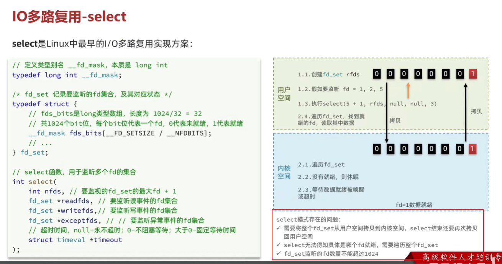

### 2.6 网络模型-IO多路复用模型-poll模式

poll 模式对 select 模式做了简单改进，但性能提升不明显，部分关键代码如下：


这里的 pollfd 的 revents 属性在实际的类型发生之后会由系统回写，不需要由用户定义。

> 此时已经没有了 1024 的限制，理论上来讲可以监听无上限个 FD。

IO流程：

* 创建pollfd数组，向其中添加关注的fd信息，数组大小自定义。
* 调用poll函数，**将pollfd数组拷贝到内核空间，转链表存储**，无上限。
* 内核遍历fd，判断是否就绪。
* 数据就绪或超时后，**拷贝pollfd数组到用户空间**，返回就绪fd数量n（如果全部超时则返回 0）。
* 用户进程判断n是否大于0，**大于0则遍历pollfd数组，找到就绪的fd**。

**与 select 对比：**

* select 模式中的 fd_set 大小固定为 1024，**而 pollfd 在内核中采用链表**，理论上无上限。
* 监听 FD 越多，每次遍历消耗时间也越久，性能反而会下降（因为 FD 无上限的缘故）。

### 2.7 网络模型-IO多路复用模型-epoll函数

epoll 模式是对 select 和 poll 的改进，它提供了三个函数：

第一个是：调用 epoll_create 函数，其会创建 eventpoll，它内部包含两个东西。

1. rbr => 红黑树 -> 记录的事要监听的 FD（记录的是所有的 FD）。

   > 为什么需要红黑树？
   >
   > 红黑树的诞生就是为了解决二叉查找树的缺陷。
   >
   > 二叉查找树是一种基于比较的数据结构，它的每个节点都有一个键值，而且左子节点的键值小于父节点的键值，右子节点的键值大于父节点的键值。这样的结构可以方便地进行查找、插入和删除操作，因为只需要比较节点的键值就可以确定目标节点的位置。但是，二叉查找树有一个很大的问题，就是它的形状取决于节点插入的顺序。如果节点是按照升序或降序的方式插入的，那么二叉查找树就会退化成一个线性结构，也就是一个链表。这样的情况下，二叉查找树的性能就会大大降低，时间复杂度就会从 O(logn) 变为 O(n)。
   >
   > 红黑树的诞生就是为了解决二叉查找树的缺陷，因为二叉查找树在某些情况下会退化成一个线性结构。
   >
   > **红黑树是一种特化的AVL树（平衡二叉树），都是在进行插入和删除操作时通过特定操作保持二叉查找树的平衡，从而获得较高的查找性能**。 

2. rdlist => 一个是链表 -> 一个链表，记录的是就绪的 FD。

调用完 epoll_create 之后，其会在内部创建一个 eventpoll 结构体，并返回对应的句柄 epfd，epfd 是唯一对应一个 eventpoll 的。

第二个：调用 epoll_ctl 函数。

```c
int epoll_ctl(
	int epfd, // epoll 实例的句柄。
    int op,
    int fd,
    struct epoll_event *event
) // 将一个 FD 添加到 eventepoll 的红黑树中，并设置 ep_poll_callback，当 callback 被触发时，就把相对应的 FD 加入到 redis 的就绪列表中。
```

紧接着调用 epoll_ctl 操作（**主要完成监听操作**），将要监听的数据添加到红黑树上去，并且给每个 fd 设置一个监听函数，这个函数会在 fd 数据就绪时触发，就是准备好了，现在就把 fd 数据添加到 list_head 中去（即**就绪队列**）。

调用epoll_wait函数。

```c
int epoll_wait(
	int epfd, // eventpoll 实例的句柄。
    struct epoll_event *events // 空 event 数组，用于接收就绪的 FD。
    int maxevents, // events 数组的最大长度。
    int timeout // 超时时间。
)
```

就绪等待，在用户态创建一个空的 events 数组，当就绪之后，我们的回调函数会把数据添加到 list_head 中去，**当调用这个函数的时候，会去检查 list_head，当然这个过程需要参考配置的等待时间，可以等一定时间，也可以一直等**， 如果在此过程中，检查到了 list_head 中有数据会将数据添加到链表中，**此时将数据放入到 events 数组中，并且返回对应的操作的数量**，用户态的此时收到响应后，从 events 中拿到对应准备好的数据的节点，**再去调用方法去拿数据**。

epoll 模式的整个流程可以**如下图所示**：

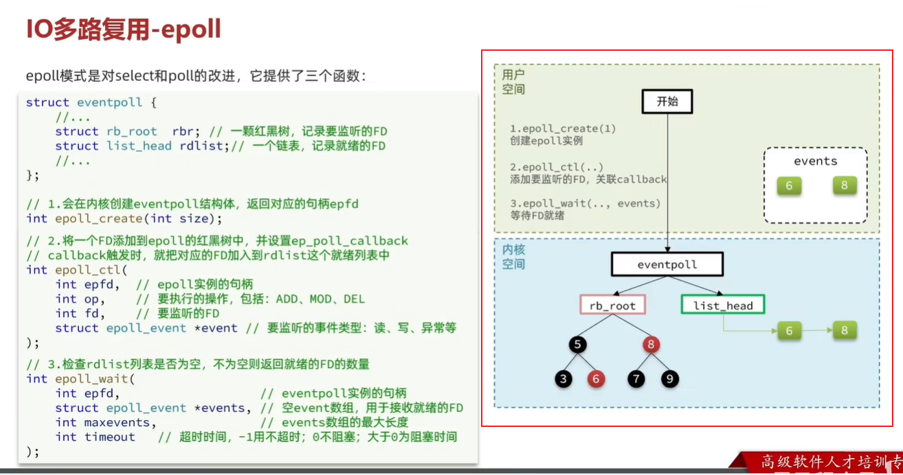

综上所述，对于一个 FD 而言，只需要执行一次 epoll_ctl 进行监听，之后不断执行 epoll_wait 等待 FD 就行即可。

**因此只会发生一次拷贝（就是执行 epoll_ctl 时的拷贝），这不像 select 或者 poll，每次都会发生拷贝**。

此外，**拷贝回来的数据也少了很多**（相较于 select，因为只有就绪数据）。

小总结：

select模式存在的三个问题：

* 能监听的 FD 最大不超过 1024
* 每次 select 都需要把所有要监听的 FD 都拷贝到内核空间
* 每次都要遍历所有 FD 来判断就绪状态

poll模式的问题：

* poll 利用链表解决了 select 中监听 FD 上限的问题，但依然要遍历所有 FD，如果监听较多，性能会下降（**因为可能链表很长，遍历时间会很久**）。

epoll模式中如何解决这些问题的？

* 基于 epoll 实例中的红黑树保存要监听的 FD，理论上无上限，**而且增删改查效率都非常高**。
* 每个 FD 只需要执行一次 epoll_ctl 添加到红黑树，**以后每次 epol_wait 无需传递任何参数，无需重复拷贝 FD 到内核空间**。
* 利用 ep_poll_callback 机制来监听 FD 状态，无需遍历所有 FD，**因此性能不会随监听的FD数量增多而下降**。

> 在类 Unix 系统中，**万物皆文件**。

### 2.8 网络模型-epoll 事件通知机制中的 ET 和 LT

当 FD 有数据可读时，我们调用 epoll_wait（或者 select、poll）可以得到通知。但是事件通知的模式有两种：

* LevelTriggered（**未读提醒**）：简称 LT，也叫做水平触发。只要某个 FD 中有数据可读，每次调用 epoll_wait 都会得到通知。
* EdgeTriggered（**直接将未读转化为已读，可能造成数据丢失**）：简称 ET，也叫做边沿触发。只有在某个 FD 有状态变化时，调用 epoll_wait 才会被通知。

举个栗子：

* 假设一个客户端 socket 对应的 FD 已经注册到了 epoll 实例中
* 客户端 socket 发送了 2kb 的数据
* 服务端调用epoll_wait，得到通知说FD就绪
* 服务端从FD读取了1kb数据回到步骤3（**再次调用epoll_wait，形成循环**）

结论

如果我们采用 LT 模式，因为FD中仍有1kb数据，则**第⑤步依然会返回结果，并且得到通知**。

如果我们采用ET模式，因为第③步已经消费了FD可读事件，第⑤步FD状态没有变化，**因此epoll_wait不会返回，数据无法读取，客户端响应超时**。

对于 ET 的缺陷，有两种应对方式：

* 可以使用 epoll_ctl 的 MOD 操作修改 FD 状态，将就绪 FD 放回 list_head 中。
* 服务端重复读取 epoll_wait 返回出来的数据，直至读取完毕。

LT 的弊端：

* 多次通知会有性能问题。
* 会出现惊群现象。

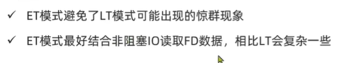

### 2.9 网络模型-基于 epoll 的服务器端流程

> 本小节描述了 **Web 服务端的网络模型**。

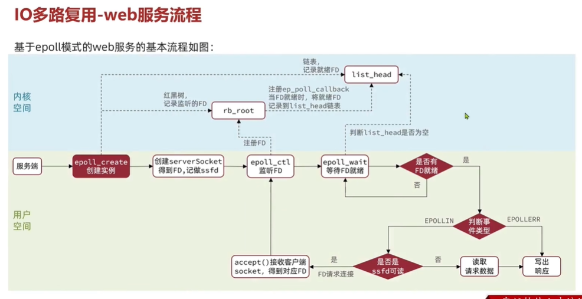

服务器启动以后，服务端会去调用 epoll_create，创建一个 epoll 实例，epoll 实例中包含两个数据：

1. 红黑树（为空）：rb_root 用来去记录需要被监听的FD。
2. 链表（为空）：list_head，用来存放已经就绪的FD。

创建好了之后，会去调用epoll_ctl函数，**此函数会会将需要监听的数据添加到rb_root中去，并且对当前这些存在于红黑树的节点设置回调函数**，当这些被监听的数据一旦准备完成，就会被调用，而调用的结果就是将红黑树的fd添加到list_head中去(但是此时并没有完成)。

上一步完成后，就会调用epoll_wait函数，这个函数会去校验是否有数据准备完毕（因为数据一旦准备就绪，就会被回调函数添加到list_head中），在等待了一段时间后(可以进行配置)，如果等够了超时时间，则返回没有数据，如果有，则进一步判断当前是什么事件，如果是建立连接事件，则调用accept() 接受客户端socket，拿到建立连接的socket，然后**建立起来连接**（并**将 socket 客户端的 FD 挂载到 rb_root 上**），如果是其他事件（比如普通的客户端请求或者异常事件），则把数据**进行写出**。


> 处理请求需要读，因此这里是**读事件**。

### 2.10 网络模型-信号驱动与异步IO（使用得比较少）

#### 2.10.1 信号驱动 IO

信号驱动 IO 是与内核建立 SIGIO 的信号关联并设置回调，当内核有 FD 就绪时，会发出 SIGIO 信号通知用户，期间用户应用可以执行其它业务，无需阻塞等待。

> 有点类似于事件监听机制。
>
> * select、poll 和 epoll 机制均是用户进程主动去问询 FD 是否就绪。
> * 信号驱动 IO 则是由就绪的 FD 通知用户进程。

阶段一：

* 用户进程调用 sigaction，注册信号处理函数。
* 内核返回成功，开始监听 FD。
* 用户进程不阻塞等待，可以执行其它业务。
* **当内核数据就绪后，回调用户进程的 SIGIO 处理函数**。

阶段二：

* 收到 SIGIO 回调信号。
* **调用 recvfrom，读取**。
* 内核将数据拷贝到用户空间。
* 用户进程处理数据。


信号驱动 IO 的缺点：

* 当有大量 IO 操作时，信号较多，SIGIO 处理函数不能及时处理可能导致信号队列溢出。
* 内核空间与用户空间的频繁信号交互性能也较低。

#### 2.10.2 异步IO

这种方式，不仅仅是用户态在试图读取数据后，不阻塞，**而且当内核的数据准备完成后，也不会阻塞**。

他会由内核将所有数据处理完成后，由内核将数据写入到用户态中，然后才算完成，所以性能极高，不会有任何阻塞，全部都由内核完成，可以看到，异步IO模型中，用户进程**在两个阶段都是非阻塞状态**。

> 异步 IO **直接将等待数据和拷贝数据合二为一了**（或者说直接一并处理了，不需要通过 recvfrom 来进行数据拷贝），中间不再需要**用户态**来插手了。


异步 IO 的缺点：

* 如果不加限制，高并发情况下，会导致 IO 任务过多，从而造成内存占用高的问题。
* 但是如果加上限流操作，代码实现的复杂度则较高。

#### 2.10.3 对比

最后用一幅图，来说明他们之间的区别：


IO 操作是同步还是异步，关键看数据在内核空间与用户空间的拷贝过程（数据读写的 IO 操作），也就是阶段二是同步还是异步。

因此综上所述，**只有异步 IO 是异步的，其余的四种 IO 均是同步 IO**。

### 2.11 网络模型-Redis是单线程的吗？为什么使用单线程

**Redis到底是单线程还是多线程？**

* 如果仅仅聊Redis的**核心业务部分（命令处理），答案是单线程**。
* 如果是聊**整个Redis，那么答案就是多线程**。

  > 多线程的举例如：
  >
  > * 删除 big key 的 unlink 命令。
  > * bgsave。
  > * AOF 的 rewrite 机制。

在Redis版本迭代过程中，在两个重要的时间节点上引入了多线程的支持：

* Redis v4.0：**引入多线程异步处理一些耗时较旧的任务，例如异步删除命令unlink**。
* Redis v6.0：**在核心网络模型中引入多线程，进一步提高对于多核CPU的利用率**。

因此，对于Redis的核心网络模型，在Redis 6.0之前确实都是单线程。**是利用epoll（Linux系统）这样的IO多路复用技术在事件循环中不断处理客户端情况**。

**为什么Redis要选择单线程？**

* 抛开持久化不谈，Redis是纯内存操作，执行速度非常快，**它的性能瓶颈是网络延迟而不是执行速度，因此多线程并不会带来巨大的性能提升**。
* 多线程会导致过多的**上下文切换**，带来不必要的开销
* 引入多线程会面临**线程安全问题**，必然要引入线程锁这样的安全手段，实现复杂度增高，而且性能也会大打折扣

### 2.12 Redis的单线程模型-Redis单线程和多线程网络模型变更

> 关于 **server.listen(ip, port)** 的含义 =>
>
> 这意味着服务监听 `ip:port`，我们可以使用 `http://ip:port` 来访问该服务。一般来讲，这里的 ip 有四种类型：
>
> 1. 127.0.0.1，本地回环地址，只能本机访问。
> 2. 192.168.1.100，只能局域网访问。
> 3. 203.0.113.10，允许公网访问。
> 4. 0.0.0.0，`0.0.0.0` 是一个特殊的 IP 地址，通常被用来表示“任意地址”或“所有地址”。当一个服务器监听在 `0.0.0.0` 地址上时，它将会接受发送到该机器上所有网络接口的连接请求。

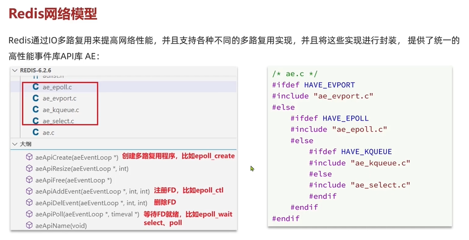

Redis 网络模型的源码：

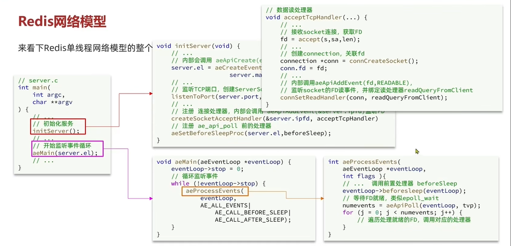

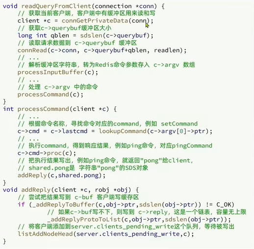

这里提到了输入缓冲区（c->queryBuf）和输出缓冲区（c->buf 和 c->reply）。**输出缓冲区可能会造成内存溢出的问题**。


以上代码监听了客户端 socket 的写事件，并将**结果返回**。

Redis 单线程网络模型的整个流程如下图所示：

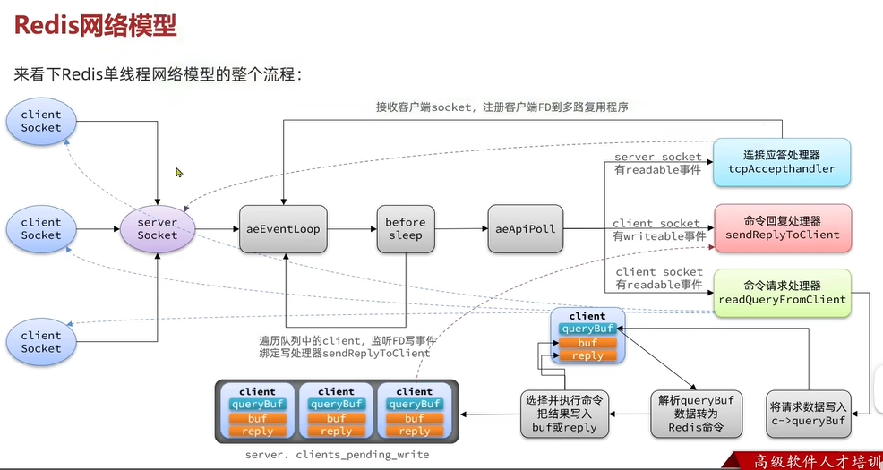

本质上 aeEventLoop、beforesleep 和 aeApiPoll 起到了 **IO 多路复用 + 事件派发**的作用。


当我们的客户端想要去连接我们服务器，会去**先到IO多路复用模型去进行排队**，会有一个**连接应答处理器**，他会去接受读请求，然后又把读请求注册到具体模型中去，此时这些建立起来的连接，如果是客户端请求处理器去进行执行命令时，他会去把数据读取出来（**命令请求处理器**），然后把数据放入到client中， clinet去解析当前的命令转化为redis认识的命令，接下来就开始处理这些命令，从redis中的command中找到这些命令，然后就真正的去操作对应的数据了，当数据操作完成后，会去找到**命令回复处理器**，再由他将数据写出。

Redis 6.0 引入了多线程，是为了解决上述网络模型中的瓶颈问题，经过分析可知，上述模型的瓶颈主要在于 IO 部分，即命令请求处理器部分（**将请求数据写入**）和命令回复处理器部分（**将响应结果写出**）。

因此多线程主要是针对这两部分做了优化。

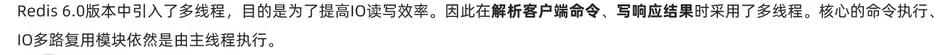

> 影响性能的大头基本都是 **IO**。

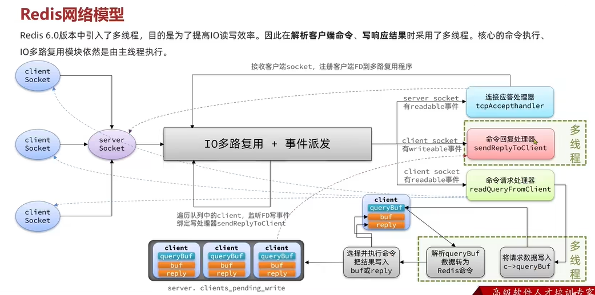

做出这些改进之后，单次命令的响应时间没有多大改进，但是服务的吞吐量有了很大提升。

## 3、Redis通信协议-RESP协议

Redis 是一个 CS 架构的软件，通信一般分两步（不包括 Pipeline 和 PubSub）：

* 客户端（client）向服务端（server）发送一条命令。
* 服务端解析并执行命令，返回响应结果给客户端。

因此客户端发送命令的格式、服务端响应结果的格式必须有一个规范，这个规范就是**通信协议**。

而在 Redis 中采用的是 RESP（Redis Serialization Protocol）协议：

* Redis 1.2版本引入了RESP协议。
* Redis 2.0版本中成为与Redis服务端通信的标准，称为RESP2。
* Redis 6.0版本中，从RESP2升级到了RESP3协议（RESP3 和 RESP2 之间出现了兼容性问题），增加了更多数据类型并且支持6.0的新特性--**客户端缓存**。

但目前，默认使用的依然是RESP2协议，也是我们要学习的协议版本（以下简称RESP）。

在RESP中，通过**首字节的字符来区分不同数据类型**，常用的数据类型包括5种（类似于 JSON 或者 YAML 格式）：

* 单行字符串：首字节是 ‘+’，后面跟上单行字符串，以CRLF（"\r\n"）结尾。例如返回"OK"："+OK\r\n"。

* 错误（Errors）：首字节是 ‘-’ ，与单行字符串格式一样，只是字符串是异常信息，例如："-Error message\r\n"。

* 数值：首字节是 ‘:’ ，后面跟上数字格式的字符串，以CRLF结尾。例如：":10\r\n"。

* 多行字符串（参考 SDS 的二进制安全保证方法，**先给出字符串的长度**）：首字节是 ‘$’ ，表示二进制安全的字符串，最大支持512MB：

  

  * 如果大小为0，则代表空字符串："$0\r\n\r\n"。
  * 如果大小为-1，则代表不存在："$-1\r\n"。

* 数组（**一般客户端发过来的命令就是这种数据格式，但是所有的数据格式都有可能作为服务端的响应**）：首字节是 ‘*’，后面跟上数组元素个数，再跟上元素，**元素数据类型不限（也可以是数组本身）**：


UTF-8 中，中文编码占据 3 个字节。

另外，值得注意的是， **Redis AOF 文件的文件格式就是遵循 RESP 协议的**。 

### 3.1 Redis通信协议-基于Socket自定义Redis的客户端

Redis 支持 TCP 通信，因此我们可以使用Socket来模拟客户端，与Redis服务端建立连接：

```java
public class Main {

    static Socket s;
    static PrintWriter writer;
    static BufferedReader reader;

    public static void main(String[] args) {
        try {
            // 1.建立连接
            String host = "192.168.150.101";
            int port = 6379;
            s = new Socket(host, port);
            // 2.获取输出流、输入流
            writer = new PrintWriter(new OutputStreamWriter(s.getOutputStream(), StandardCharsets.UTF_8));
            reader = new BufferedReader(new InputStreamReader(s.getInputStream(), StandardCharsets.UTF_8));

            // 3.发出请求
            // 3.1.获取授权 auth 123321
            sendRequest("auth", "123321");
            Object obj = handleResponse();
            System.out.println("obj = " + obj);

            // 3.2.set name 虎哥
            sendRequest("set", "name", "虎哥");
            // 4.解析响应
            obj = handleResponse();
            System.out.println("obj = " + obj);

            // 3.2.set name 虎哥
            sendRequest("get", "name");
            // 4.解析响应
            obj = handleResponse();
            System.out.println("obj = " + obj);

            // 3.2.set name 虎哥
            sendRequest("mget", "name", "num", "msg");
            // 4.解析响应
            obj = handleResponse();
            System.out.println("obj = " + obj);
        } catch (IOException e) {
            e.printStackTrace();
        } finally {
            // 5.释放连接
            try {
                if (reader != null) reader.close();
                if (writer != null) writer.close();
                if (s != null) s.close();
            } catch (IOException e) {
                e.printStackTrace();
            }
        }
    }

    private static Object handleResponse() throws IOException {
        // 读取首字节
        int prefix = reader.read();
        // 判断数据类型标示
        switch (prefix) {
            case '+': // 单行字符串，直接读一行
                return reader.readLine();
            case '-': // 异常，也读一行
                throw new RuntimeException(reader.readLine());
            case ':': // 数字
                return Long.parseLong(reader.readLine());
            case '$': // 多行字符串
                // 先读长度
                int len = Integer.parseInt(reader.readLine());
                if (len == -1) {
                    return null;
                }
                if (len == 0) {
                    return "";
                }
                // 再读数据,读len个字节。我们假设没有特殊字符，所以读一行（简化）
                return reader.readLine();
            case '*':
                return readBulkString();
            default:
                throw new RuntimeException("错误的数据格式！");
        }
    }

    private static Object readBulkString() throws IOException {
        // 获取数组大小
        int len = Integer.parseInt(reader.readLine());
        if (len <= 0) {
            return null;
        }
        // 定义集合，接收多个元素
        List<Object> list = new ArrayList<>(len);
        // 遍历，依次读取每个元素
        for (int i = 0; i < len; i++) {
            list.add(handleResponse());
        }
        return list;
    }

    // set name 虎哥
    private static void sendRequest(String ... args) {
        writer.println("*" + args.length);
        for (String arg : args) {
            writer.println("$" + arg.getBytes(StandardCharsets.UTF_8).length);
            writer.println(arg);
        }
        writer.flush();
    }
}
```

### 3.2 Java 字符流和字节流的区别

参考文章：https://www.cnblogs.com/lonely-wolf/p/14647514.html。

**字节流**：

**字节流读取的基本单位为字节（Byte）**，采用的是 `ASCII` 编码，通常用来处理二进制数据，其顶层抽象类为 `InputStream` 和 `OutputStream`。


`IO` 操作是一个比较耗时的操作，而字节流的 `read` 方法一次只能返回一个字节，**那么当我们需要读取多个字节时就会出现每次读取都要进行一次 `IO` 操作，而缓冲流内部定义了一个大小为 `8192` 的 `byte` 数组，当我们使用了缓冲流时，读取数据的时候则会一次性最多读取 `8192` 个字节放到内存**，然后一个个依次返回，这样就大大减少了 `IO` 次数；同样的，写数据时，缓冲流会将数据先写到内存，当我们写完需要写的数据时再一次性刷新到指定位置，如磁盘等。

**字符流**：

字符流读取的基本单位为**字符**（占用**两个**字节），采用的是 `Unicode` 编码，其 `read` 方法返回的是一个 `Unicode` 码元（0~65535）。字符流通常用来处理文本数据，其顶层抽象类为 `Reader` 和 `Write`。

> Unicode 编码占据两个字节，而 UTF-8 编码则占据一个到四个字节不等（例如中文一般是 3 字节）。**UTF-8是一种可变长度的编码方案**。


输出之后可以很明显看出区别，字节流一次读入一个字节，**而字符流一次读入一个字符**。

> 在Java中，`writer.flush()`是一个用于刷新输出流的方法。当你使用输出流（如`BufferedWriter`或`PrintWriter`等）将数据写入到目标（如文件或网络连接）时，有时候数据并不会立即写入到目标，而是先缓存到内存中。**`flush()`方法的作用就是将缓冲区中的数据强制刷新到目标中，确保数据被写入到目标中，而不是停留在缓冲区中**。

## 4、Redis内存回收

### 4.1 过期 key 处理

Redis之所以性能强，最主要的原因就是基于内存存储。然而单节点的 Redis 其内存大小不宜过大，会影响持久化或主从同步性能。

我们可以通过修改配置文件来设置 Redis 的**最大内存**：


当内存使用达到上限时，就无法存储更多数据了。为了解决这个问题，Redis提供了一些策略实现内存回收：

内存过期策略

在学习 Redis 缓存的时候我们说过，**可以通过expire命令给Redis的key设置TTL（存活时间）**：


可以发现，当 key 的 TTL 到期以后，再次访问 name 返回的是 nil，**说明这个 key 已经不存在了，对应的内存也得到释放。从而起到内存回收的目的**。


**Redis是如何知道一个key是否过期呢**？

> 利用两个Dict分别记录key-value对及key-ttl对。

Redis本身是一个典型的key-value内存存储数据库，因此所有的key、value都保存在之前学习过的Dict结构中。不过在其database结构体中，有两个Dict：**一个用来记录key-value；另一个用来记录key-TTL**。


**是不是TTL到期就立即删除了呢**？

**惰性删除**：

惰性删除：顾明思议并不是在 TTL 到期后就立刻删除，**而是在访问一个 key 的时候，检查该 key 的存活时间，如果已经过期才执行删除**。


倘若只依靠惰性删除，**那么如果 key 很长时间不被访问，则其一直不能被清除，造成内存泄漏**。因此，Redis 引入了周期删除。

**周期删除**：

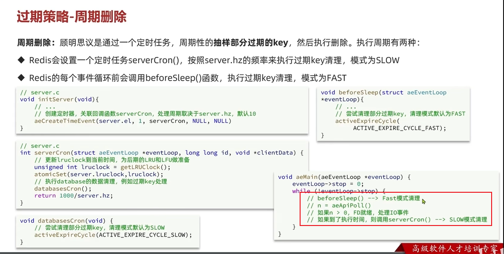

周期删除，顾名思义，是通过一个定时任务，**周期性的抽样部分过期的key**，然后执行删除。执行周期有两种：

* Redis 服务初始化函数 **initServer**() 中设置定时任务，按照 server.hz 的频率来执行过期 key 清理，模式为 SLOW（**低频深度清理**）。
* Redis的每个事件循环前会调用 **beforeSleep**() 函数，执行过期 key 清理，模式为 FAST（**高频表层清理**）。

SLOW 模式规则：

* 执行频率受 server.hz 影响，默认为10，即每秒执行10次，每个执行周期100ms。
* 执行清理耗时不超过一次执行周期的25%.默认slow模式耗时不超过25ms
* 逐个遍历db，逐个遍历db中的bucket（**这是一种遍历策略，最终会将 16 个 redisDB 都遍历一遍**），抽取20个key判断是否过期（**周期删除是一种抽样删除**）。
* 如果没达到时间上限（25ms）并且过期 key 比例大于 10%（**说明过期 key 较多**），再进行一次抽样，否则结束。

FAST 模式规则：

* 执行频率受 beforeSleep() 调用频率影响，但两次 FAST 模式间隔不低于 2ms
* 执行清理耗时不超过 1ms
* 逐个遍历 db，逐个遍历 db 中的 bucket，抽取 20 个 key 判断是否过期。
* 如果没达到时间上限（1ms）并且过期 key 比例大于 10%，再进行一次抽样，否则结束。

**总结**：

RedisKey的TTL记录方式：

* 在RedisDB中通过一个Dict记录每个Key的TTL时间。

过期key的删除策略：

* 惰性清理：每次查找key时判断是否过期，如果过期则删除

* 定期清理：定期抽样部分key，判断是否过期，如果过期则删除。

定期清理的两种模式：

* SLOW模式执行频率默认为10，每次不超过25ms
* FAST模式执行频率不固定，但两次间隔不低于2ms，每次耗时不超过1ms

### 4.2 内存淘汰策略

为什么需要**淘汰策略**？

在某些大型项目中，仅仅依靠内存过期策略可能还是会让内存达到上限，此时就需要 Redis 主动淘汰一些数据了。

内存淘汰：**就是当Redis内存使用达到设置的上限时，主动挑选部分key删除以释放更多内存的流程**。

> 内存淘汰策略会在数据不过期时也删除相应的 key。

Redis会在处理客户端命令的方法 processCommand() 中尝试做内存淘汰：


**Redis 是在什么时候检查内存的呢**？

是在任何命令执行之前进行检查的（即在 processCommand() 函数中），并尝试淘汰一部分内存。

**Redis 有哪些内存淘汰策略？**

Redis 支持 8 种不同策略来选择要删除的 key：

* noeviction：**不淘汰任何key**，但是内存满时不允许写入新数据，默认就是这种策略。
* volatile-ttl： 对设置了TTL的key，比较key的剩余TTL值，**TTL越小越先被淘汰**。
* allkeys-random：对全体key ，随机进行淘汰。**也就是直接从db->dict中随机挑选**。
* volatile-random：对设置了TTL的key ，随机进行淘汰。**也就是从db->expires中随机挑选**。
* allkeys-lru： 对全体key，基于LRU算法进行淘汰
* volatile-lru： 对设置了TTL的key，基于LRU算法进行淘汰
* allkeys-lfu： 对全体key，基于LFU算法进行淘汰
* volatile-lfu： 对设置了TTL的key，基于LFI算法进行淘汰

比较容易混淆的有两个：

* LRU（Least Recently Used），**最少最近使用。用当前时间减去最后一次访问时间，这个值越大则淘汰优先级越高**。（LRU 可以被翻译成**最不是最近使用**）
* LFU（Least Frequently Used），最少频率使用。会统计每个key的访问频率，值越小淘汰优先级越高。

Redis 的数据都会被封装为 RedisObject 结构：


由于只有八位记录访问次数，太少了，因此为了能够反映出访问次数，这里引入了逻辑访问次数。

LFU 的访问次数之所以叫做逻辑访问次数，**是因为并不是每次 key 被访问都计数，而是通过运算**：

* 生成0~1之间的随机数R。
* 计算 (旧次数 * lfu_log_factor + 1)，记录为 P。
* 如果 R < P ，则计数器 + 1，且最大不超过 255。
* **访问次数会随时间衰减，距离上一次访问时间每隔 lfu_decay_time 分钟，计数器 - 1**。

最后用一副图来**描述内存淘汰的流程** =>


Redis 在实际执行 LFR、LRU 或者 TTL 淘汰时，并不会真正去比较所有的 key（否则的话会花费大量的时间），而是**抽样一些 key** 进行相应的比较并完成淘汰。

这些被抽取的 key 会放到一个名为 eviction_pool 的淘汰池，淘汰池中的 key 会依据某个指标做升序排列，指标越大的越优先被淘汰。如此一来保证了淘汰的逻辑是一致的，现在只需要考虑对于不同淘汰策略而言，如何计算指标（idleTime）。

指标计算完成之后。并不能直接将其放到 eviction_pool 中，在 eviction_pool 已满的情况下，需要做一个判断，要保证被添加进去的 key 是更值得被删除的，即其 idleTime 比目前 eviction_pool 最小的 idleTime 要大。

